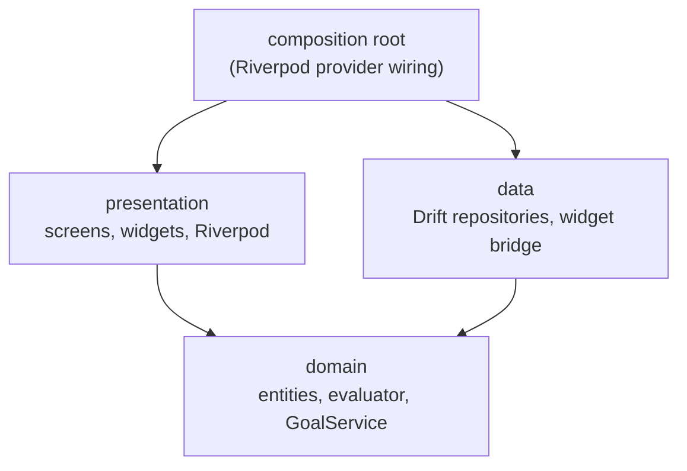
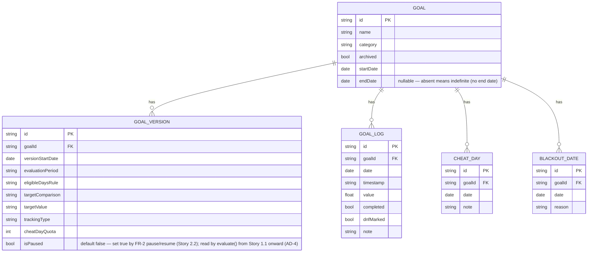
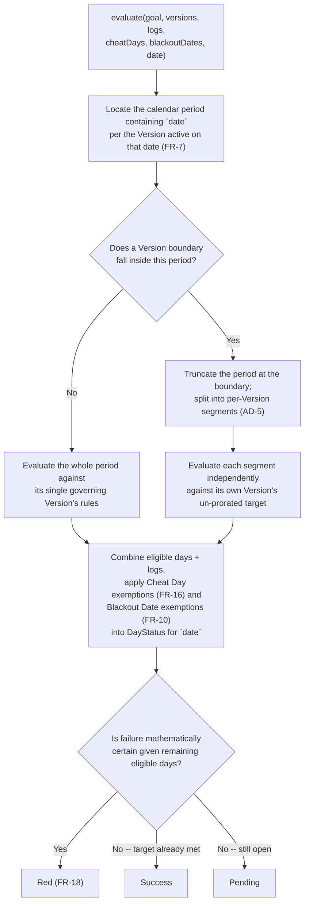

# Architecture Spine — Goal Tracker

## Design Paradigm

Layered/hexagonal, domain-centric. Three layers, one dependency direction:

- **domain** — `Goal`, `GoalVersion`, `GoalLog`, `CheatDay`, `BlackoutDate`, `DayStatus` entities; the evaluator; `GoalService`; `StatsService`. Defines repository and `CacheWriter` interfaces but implements neither. Zero Flutter or Drift imports. Depends on nothing else in this app.
- **data** — Drift tables/DAOs, repository implementations of domain-defined interfaces, the `CacheWriter` implementation, JSON import/export serialization, the widget data bridge. Depends on domain only.
- **presentation** — screens, in-app widgets, Riverpod providers. Depends on domain only; never imports Drift directly.

Domain-defined interfaces (repositories, `CacheWriter`) are how `data`-layer concerns like cache invalidation get triggered from a domain use-case without domain ever depending on `data` — the same inversion AD-3 already relies on for persistence.

The reason this paradigm and not something looser: the PRD requires the *same* rule evaluation to back two callers with different freshness guarantees — the live calendar (always fresh) and the widgets/stats (cached). That only stays consistent if evaluation is one pure, storage- and UI-agnostic function every caller shares. A domain-centric split is what makes that function isolatable and unit-testable, which is also what NFR-6 ("correctness as core quality bar") requires in practice.



## Invariants & Rules

### AD-1 — Layered/Hexagonal Paradigm

- **Binds:** all
- **Prevents:** the evaluator being reimplemented or diverging between the live-calendar path and the cached widget/stats path; domain logic becoming untestable by entangling it with UI or storage.
- **Rule:** `domain` has zero imports of Flutter or Drift. `data` and `presentation` depend on `domain`; `domain` depends on neither. Only the composition root (provider wiring) imports across all three.

### AD-2 — Riverpod for State & Dependency Injection

- **Binds:** presentation layer, all cross-layer wiring (repositories, evaluator, services)
- **Prevents:** `BuildContext`-coupled domain access; untestable, singleton/service-locator-style dependency access.
- **Rule:** all cross-layer dependencies are exposed as Riverpod providers (`@riverpod` code-gen style, 3.x line). No direct singleton or service-locator access anywhere in the app.

### AD-3 — Drift as Sole Local Persistence

- **Binds:** data layer, the `goals` / `goal_versions` / `goal_logs` schema
- **Prevents:** hand-rolled reactive/pub-sub plumbing for calendar recompute; NoSQL-shaped workarounds for relational queries the data model requires (period-boundary lookups, rolling-window aggregation, multi-entry-per-day sums).
- **Rule:** all local persistence of domain data goes through Drift. No parallel storage mechanism for domain data; `shared_preferences` (or equivalent) is permitted only for simple user settings (week-start day, reminder time) that are not part of the Goal/Version/Log model.

### AD-4 — Pure Evaluator Contract

- **Binds:** domain layer, NFR-6
- **Prevents:** evaluation logic leaking into repositories, widgets, or the cache writer — which would make the hardest edge cases (version boundaries, rolling windows, cheat-day/exact-target interaction) untestable in isolation and re-implementable differently in each caller; two repositories handing the evaluator differently-ordered input and getting different results for identical data.
- **Rule:** one pure function, `DayStatus evaluate({Goal goal, List<GoalVersion> versions, List<GoalLog> logs, List<CheatDay> cheatDays, List<BlackoutDate> blackoutDates, DateTime date})`. FR-4 names Cheat Days as a direct input to status computation, and FR-10 requires Blackout Dates to exempt a date without changing the eligible-day count — both must reach the evaluator, not just the target/version data. No I/O, no Flutter, no Drift, fully deterministic. Inputs may arrive in any order from a caller; `evaluate()` sorts `versions` by `versionStartDate` and `logs`/`cheatDays`/`blackoutDates` by `date` internally before use — determinism never depends on caller-supplied ordering. All callers (live calendar, `CacheWriter`, `StatsService`, widget precompute) call this same function; none re-implements evaluation logic.
- **Pause awareness (FR-2):** `GoalVersion.isPaused` is a field on the same `versions` list already passed in — no separate parameter is needed. When computing a period's eligible-day pool, the evaluator treats every date governed by a Version where `isPaused == true` as contributing zero eligible days to that pool, the same way a date excluded by `eligibleDaysRule` contributes zero. This field exists on `GoalVersion` from the first implementation of `evaluate()` (Epic 1 Story 1.1 onward) even though nothing sets it to `true` until Epic 2 Story 2.2 — the same "build the contract ahead of the feature that uses it" approach already applied to `versions` itself.

### AD-5 — Version-Boundary Period Splitting (No Pro-Rating)

- **Binds:** evaluator, FR-3, FR-4, FR-7
- **Prevents:** an evaluator that pro-rates targets across a version change (no pro-rating formula is specified anywhere in the requirements) or one that retroactively reassigns a whole period's target to a later Version (which would violate FR-3's per-date Version guarantee).
- **Rule:** a `GoalVersion`'s evaluation window is `[version.startDate, nextVersion.startDate or goal end]`. The evaluated period boundary is the calendar boundary (FR-7) **intersected** with the Version window. When a Version changes mid-period, the period is truncated at that boundary; the truncated segment is evaluated in full against its own Version's un-prorated target for however many days it actually covers. No cross-Version blending within one evaluated segment.
- **Pause/resume carve-out:** this truncate-and-re-target rule applies only when a Version boundary reflects an actual rule change (`evaluationPeriod`, `eligibleDaysRule`, `targetComparison`, `targetValue`, `trackingType`, or `cheatDayQuota` differs from the adjacent Version — e.g. an FR-3 edit). A boundary caused solely by `isPaused` toggling, with every other rule field identical across it, is **not** a rule-change boundary: the enclosing period is evaluated as a single continuous period against one un-split target, and dates governed by the paused Version simply contribute zero eligible days to that period's pool (per AD-4's pause-awareness rule) rather than forking off their own truncated segment. This keeps a mid-period pause from making an otherwise-achievable target impossible by shrinking the days available without shrinking the pool it's measured against.

### AD-6 — GoalService Owns All Version and Log Writes

- **Binds:** FR-2, FR-3, FR-15, FR-33, FR-34, FR-36
- **Prevents:** repositories or UI creating/mutating `GoalVersion`s or `GoalLog`s directly, producing divergent versioning/logging behavior between screens and import; two same-day edits producing duplicate-`versionStartDate` rows.
- **Rule:** `GoalService` (domain layer) is the **only** component permitted to write a `GoalVersion` or a `GoalLog` — every edit that changes target/eligible-days/lifecycle state, every log entry (including corrections), and every write produced by JSON import (FR-34) routes through it; no repository is called directly by presentation or by import code. `GoalService` enforces the correction-delta floor (floored at 0, FR-15) before persisting a `GoalLog`. `GoalService` enforces at most one `GoalVersion` per `(goalId, versionStartDate)`: a same-day second edit amends the still-log-free Version in place; once any `GoalLog` exists against it, a same-day edit is rejected and the caller must choose a later effective date. A `GoalVersion` is never mutated in place once `GoalLog`s exist against it. Reset/Erase-All (FR-36) is a `GoalService` use-case that clears all Drift tables plus the settings store inside one transaction.

### AD-7 — Status Cache: Read-Optimization Only, Single Writer, Fully Recomputable

- **Binds:** FR-4, FR-20, FR-28, FR-31
- **Prevents:** UI or ad-hoc code paths writing the cache directly; cache drift from source data; recovery logic that only handles incremental updates and can't rebuild from a corrupted or deleted cache.
- **Rule:** the per-day status cache is never a source of truth — it exists only to serve widgets and long-range stats, and must be provably re-derivable from `evaluate()` over rules + logs at any time. Its row shape is bare `DayStatus` only (see AD-8 — no separately-cached rollups). Domain defines an abstract `CacheWriter` interface; `data` supplies the Drift-backed implementation (same inversion as AD-3). It has exactly one writer — a domain use-case invokes `CacheWriter` only after a `GoalLog` write commits, a `GoalVersion` write commits, or the midnight-rollover job (FR-20) runs, each inside the same transaction as the write that triggered it (see Atomicity convention). It supports full wholesale recompute, so a corrupted or deleted cache is a rebuild, not data loss. The live calendar (FR-21–23) never reads the cache — always calls `evaluate()` fresh.

### AD-8 — StatsService Owns Streaks and Rollups

- **Binds:** FR-28, FR-29, NFR-6
- **Prevents:** streak/rollup logic being duplicated or diverging between the dashboard, goal detail screen, and widgets — each computing "current streak" slightly differently.
- **Rule:** a domain `StatsService` is the sole component that computes Streaks (FR-29: consecutive successful *periods*, not days, for non-Daily Goals) and rollups (FR-28: completion percentage, cheat-day counts, averages). It reads cached `DayStatus` rows via the repository, falling back to `evaluate()` directly for any date range not yet cached. No screen or widget computes a streak or rollup independently.

## Consistency Conventions

| Concern | Convention |
| --- | --- |
| Naming (entities, files, interfaces, events) | Domain entities: `Goal`, `GoalVersion`, `GoalLog`, `DayStatus`. Repository interfaces live in `domain`, named `<Entity>Repository`; Drift implementations in `data` named `Drift<Entity>Repository`. |
| Data & formats (ids, dates, error shapes, envelopes) | Ids: UUIDv4 strings. Calendar days: naive ISO-8601 date-only strings (`YYYY-MM-DD`), never `DateTime`-with-timezone — matches NFR-3 (no timezone/DST handling); there is nothing to convert if a day is just a date string. Domain/use-case failures: `Result`/`Either`-style return values, not thrown exceptions. |
| State & cross-cutting (mutation, errors, logging, config, auth) | All `Goal`/`Version`/`Log` mutation, including import (FR-34), routes through `GoalService` (AD-6); all cache writes route through `CacheWriter` (AD-7/AD-8). No telemetry, analytics, or crash reporting of any kind (NFR-2) — no logging framework that transmits off-device. Simple user settings (week-start day, global reminder time) via `shared_preferences`, outside the Drift schema. No auth — offline, single-user by design (brief, NFR-1). |
| Transaction atomicity (FR-19, NFR-7) | Every multi-statement domain mutation — a `GoalLog` write plus its triggered cache invalidation, a `GoalVersion` creation, Reset/Erase-All — executes inside a single Drift transaction. A kill mid-save loses at most the one in-flight, uncommitted entry; all previously committed data survives. |

## Stack

| Name | Version |
| --- | --- |
| Flutter / Dart | Current stable channel — pin exact version via `flutter --version` at project init (not fixed here; seed only) |
| flutter_riverpod | ^3.4.2 — current 2026 default for new Flutter projects |
| riverpod_generator + riverpod_annotation | ^4.0.8 / ^4.0.6 — versions independently from `flutter_riverpod` itself (confirmed via riverpod.dev's own getting-started guide) |
| drift + drift_flutter | 2.32.0+ — reactive, typesafe SQL, auto-bundles sqlite3 (no native setup required, except web, which is out of scope) |
| flutter_local_notifications | 21.0.0 — actively maintained, used for FR-30's single global reminder time |
| home_widget | 0.9.3 — actively maintained; bridges Dart-side cached `DayStatus` data to a shared container. Provides data-bridging only, **not** multi-widget UI — Today/Week/Month widget UI itself must be written natively per platform (see Deferred) |

All versions verified via web search 2026-08-17; re-verify at `flutter pub add` time since this table is seed, not a lockfile.

## Structural Seed

```text
lib/
  domain/
    entities/          # Goal, GoalVersion, GoalLog, CheatDay, BlackoutDate, DayStatus
    evaluator/          # pure evaluate() + version-boundary period splitting (AD-4, AD-5)
    services/             # GoalService (AD-6), StatsService (AD-8), repository + CacheWriter interfaces
  data/
    drift/                 # Drift tables, DAOs, generated database (AD-3)
    repositories/            # implementations of domain repository interfaces
    cache/                     # CacheWriter implementation (AD-7)
    io/                          # JSON export/import (de)serialization (FR-33, FR-34) -- writes still go through GoalService
    widget_bridge/                 # serializes cached DayStatus (date, goalId/scope, status) for home_widget's shared container
  presentation/
    screens/                         # daily entry, goal detail, calendar (day/week/month), dashboard, settings
    components/                        # reusable in-app Flutter UI (not home-screen widgets)
    providers/                           # Riverpod providers -- composition root wiring (AD-2)
  platform/
    android/                               # Kotlin / Jetpack Glance home-screen widget UI (Today/Week/Month)
    ios/                                     # Swift / WidgetKit home-screen widget UI (Today/Week/Month)
test/
  domain/                                     # evaluator unit + property-based tests, mirrors lib/domain (NFR-6)
```

**Core-entity relationships** (three-table split per addendum, supports FR-3 versioning without mutating historical evaluation):



`GOAL_LOG` carries no stored `GoalVersion` foreign key — which Version governs a given log is resolved at evaluation time by matching `date` against Version windows (AD-5), never stored, so it can never go stale when a Version is added retroactively. `GOAL_LOG.dnfMarked` (FR-17) is a display-only annotation, not an `evaluate()` input — it is superseded by the period's actual computed outcome once that period closes, per FR-17. `CHEAT_DAY` and `BLACKOUT_DATE` are direct `evaluate()` inputs (AD-4): FR-4 names Cheat Days as a status-computation input, and FR-10 requires Blackout Dates to exempt a date without changing the period's eligible-day count or target.

**Evaluator flow** (AD-4, AD-5 — the version-boundary logic the PRD explicitly deferred to architecture):



## Deferred

- **Import-conflict UX (FR-34).** The requirement is that it must always prompt, never silently resolve — the concrete flow (modal vs. per-item review list, etc.) is UX phase's call, not architecture's.
- **`Priority` field on Goal.** Left unresolved at the PRD level (addendum data-model-notes); revisit if the UX phase determines goal-list ordering needs it.
- **Native home-screen widget implementation.** `home_widget` bridges data only; the actual widget UI is native (Kotlin/Jetpack Glance on Android, Swift/WidgetKit on iOS) and platform-specific — outside this spine's Dart-side paradigm. The shared-container's field set is governed here (`widget_bridge/`: date, goalId/scope, status — see Structural Seed); its exact serialization format is not.
- **Deployment & release envelope.** No server/backend, so no environment topology to define. App-store release process (signing, CI, store listings) is intentionally out of scope for a solo-builder v1; revisit only if this stops being a single-operator build.
- **Exact pinned package versions.** The Stack table names verified-current, well-maintained packages; exact version numbers are pinned at `flutter pub add` time and owned by `pubspec.lock` once code exists.
- **Percentage-based, conditional, or goal-dependency rule types.** Explicit PRD non-goal (§6) — not architecture's concern.
